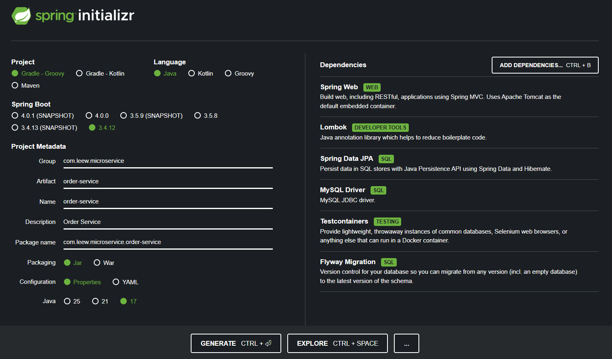
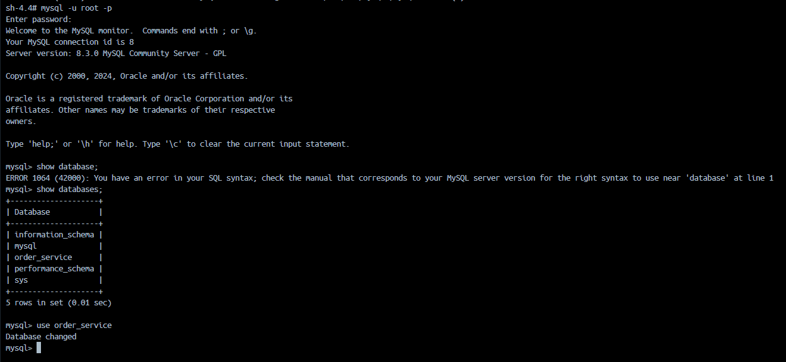
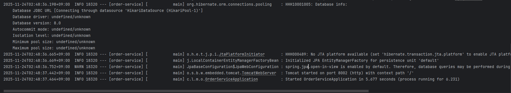
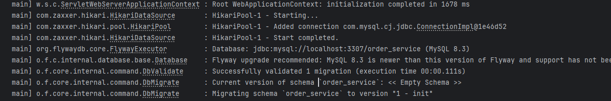
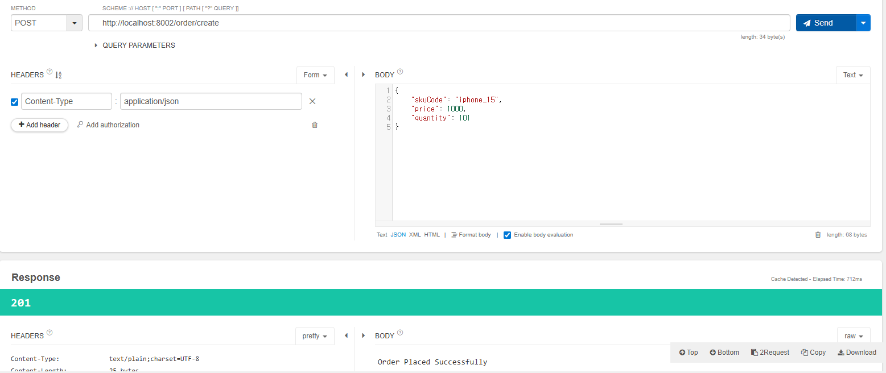
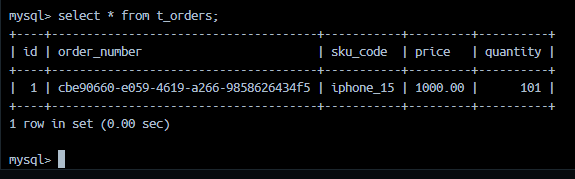
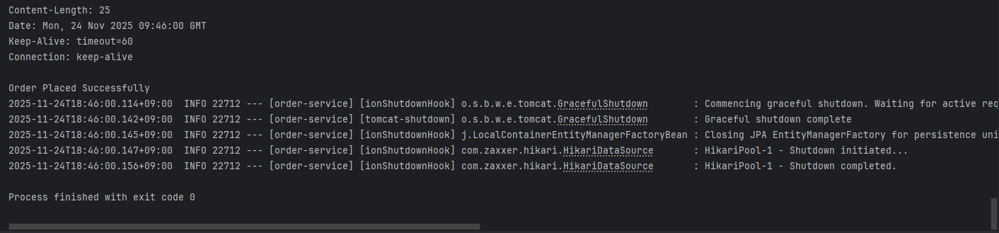

# Order_Service

---

### 서버 설정사항 
- Java JDK17
- Spring 3.X
- MySQL 8.3.0 + JPA 사용 예정 

---

### Spring Initializr

- 이번 서버에서는 MySQL 사용할 예정이므로 JPA dependency 도입 
- `TestContainers`: 인수 테스트 위한 도구 
- `Flyway Migration`: 데이터베이스 마이그레이션 툴 
    - https://ywoosang.tistory.com/18
    - https://coding-jun.tistory.com/14

---

### MySQL: docker-compose.yml로 설정 

- Port: `3307:3306`
    - 로컬 pc에 설치된 MySQL WorkBench와의 포트 겹침을 방지하기 위함
```yaml: 
version: '4'

services:
  mysql:
    image: mysql:8.3.0
    container_name: mysql
    environment:
      MYSQL_ROOT_PASSWORD: mysql
    ports:
      - "3307:3306"
    volumes:
      - ./mysql:/var/lib/mysql
      - ./docker/mysql/init.sql:/docker-entrypoint-initdb.d/init.sql
```
- `docker/mysql/init.sql`: 
```sql
CREATE DATABASE IF NOT EXISTS order_service;
```

- 실행 bash 명령어: 
```bash
# docker-compose 실행
docker-compose up -d

# 중단 
docker-compose down -v

# 중단 후 연결된 볼륨 삭제 
rm -rf ./mysql
```

- 실행 결과 :  


---

### application.yaml: 
```yaml
server:
  port: 8002

spring:
  application:
    name: order-service

  datasource:
    url: jdbc:mysql://localhost:3307/order_service
    username: root
    password: mysql
    driver-class-name: com.mysql.cj.jdbc.Driver

  jpa:
    hibernate:
      ddl-auto: none
    properties:
      hibernate:
        format_sql: true
    database-platform: org.hibernate.dialect.MySQL8Dialect
    show-sql: true
```

실행 결과 : 정상적으로 실행됨 


---

### 기능 구현 
- 간단한 기능 구현만 수행, 아래의 URL로 접속하여 커밋 내용만 확인  
https://github.com/def47619/microservice-clone/commit/ea0f4b8bdff68fd468b380903af80ddc3638d8ed
---

### FlyWay : 

- `src/main/resources/db/migration` 디렉토리에 SQL 파일 생성   
- `V<number>__<name>.sql` 형태의 이름으로 파일 생성해야 함
  
#### Step 1 : 테이블 생성 

우리는 `V1__init.sql` 이라는 이름으로 sql 파일 생성 
```sql
CREATE TABLE `t_orders`
(
    `id` BIGINT(20) NOT NULL AUTO_INCREMENT, 
    `order_number` VARCHAR(255) DEFAULT NULL, 
    `sku_code` VARCHAR(255),
    `price` DECIMAL(19, 2), 
    `quantity` int(11), 
    PRIMARY KEY (`id`)
);
```  
  
- sql 파일 생성하고 서버를 다시 실행하면,  
  
`Migrating schema "order_service" to version "1 - init"` 이라고 떠야 함

다음과 같이 
```bash
INFO 16876 --- [order-service] [           main] o.f.core.internal.command.DbMigrate      : Current version of schema `order_service`: << Empty Schema >>
INFO 16876 --- [order-service] [           main] o.f.core.internal.command.DbMigrate      : Schema `order_service` is up to date. No migration necessary.
```
No migration necessary라는 문구로 잘못 출력되면,  
1. 위 sql 파일의 위치가 잘못된 것 - 저장된 위치 다시 확인
2. 파일 위치도 맞고 + DB 컨테이너 exec해서 테이블도 정상 생성되었다면
    - 이때는 sql이 이미 실행되었고, migrate할 변경사항 없는 것 


#### Postman 등 api 테스터로 데이터 삽입 확인 

- Talend API Page로 테스트 결과


- 실제 DB에 exec하여 제대로 삽입되었는지 확인 : 정상 작동 



#### Step 2 : 테이블 수정

- `V2__add_column.sql` 파일 생성 
- 구체적인 실습은 X, 수정하려면 위 sql에 생성 


#### 인수 테스트 : RestAssured 라이브러리 사용 
- Flyway도 테스트 시 생성되는 임시 컨테이너에 대해 자동으로 적용됨 

- `OrderServiceApplicationTests.java`: 
```java
package com.leew.microservice.order_service;

import org.hamcrest.Matchers;
import org.junit.jupiter.api.BeforeEach;
import org.junit.jupiter.api.Test;
import org.springframework.boot.test.context.SpringBootTest;
import org.springframework.boot.test.web.server.LocalServerPort;
import org.springframework.boot.testcontainers.service.connection.ServiceConnection;
import org.testcontainers.containers.MySQLContainer;
import io.restassured.RestAssured;

import static org.hamcrest.MatcherAssert.assertThat;

@SpringBootTest(webEnvironment = SpringBootTest.WebEnvironment.RANDOM_PORT)
class OrderServiceApplicationTests {

	@ServiceConnection
	static MySQLContainer mySQLContainer = new MySQLContainer("mysql:8.3.0");
	@LocalServerPort
	private Integer port;

	@BeforeEach
	void setup() {
		RestAssured.baseURI = "http://localhost";
		RestAssured.port = port;
	}

	static {
		mySQLContainer.start();
	}

	@Test
	void shouldSubmitOrder() {
		String submitOrderJson = """
                {
                     "skuCode": "iphone_15",
                     "price": 1000,
                     "quantity": 1
                }
                """;


		var responseBodyString = RestAssured.given()
				.contentType("application/json")
				.body(submitOrderJson)
				.when()
				.post("/order/create")
				.then()
				.log().all()
				.statusCode(201)
				.extract()
				.body().asString();

		assertThat(responseBodyString, Matchers.is("Order Placed Successfully"));
	}
}
```

실행 결과: 
