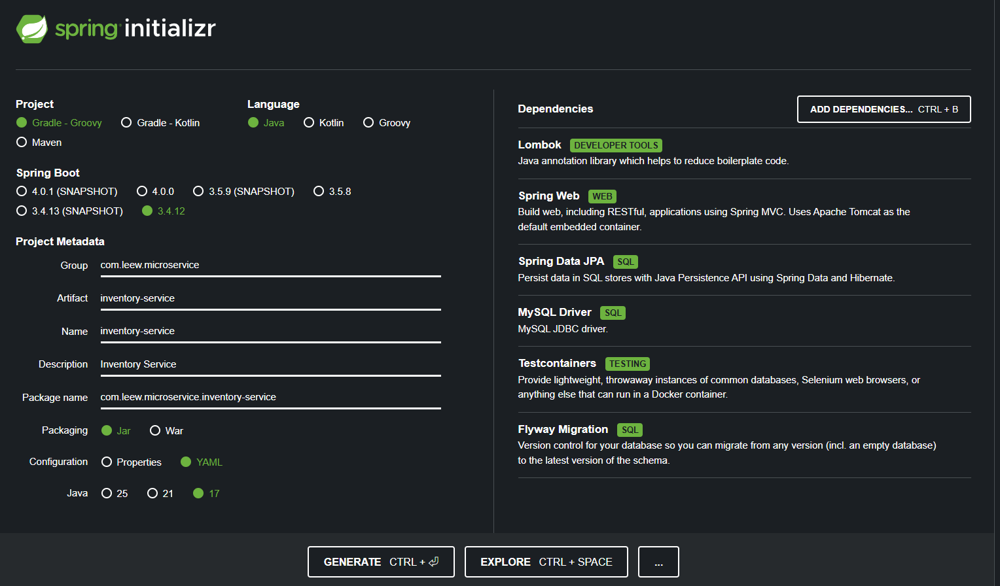
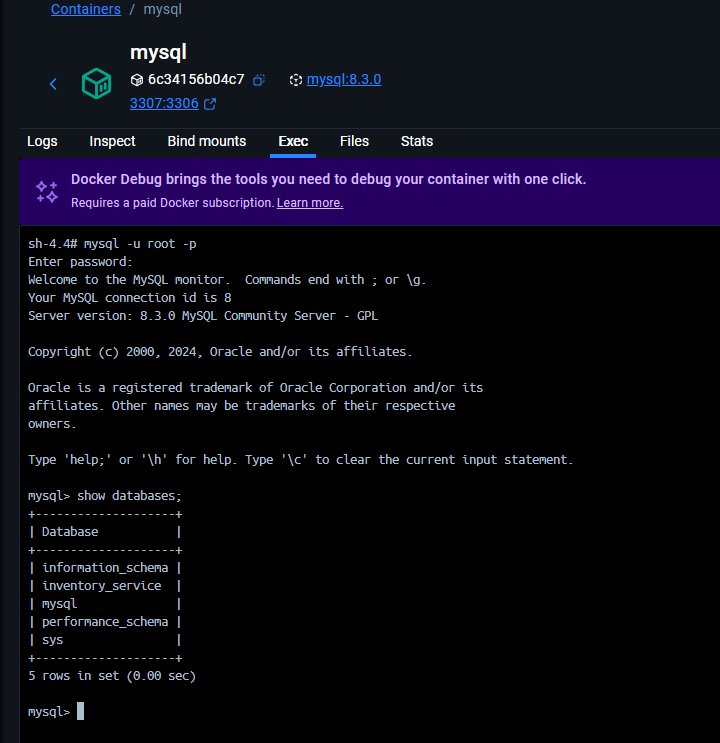
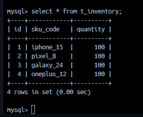
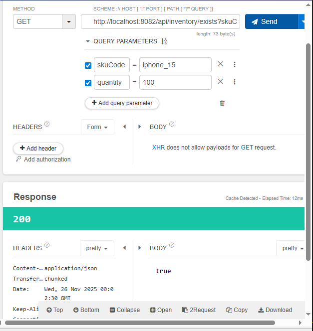

# 04_Inventory_Service

---

### 서버 설정사항 
- Java JDK17
- Spring 3.X
- MySQL 8.3.0 + JPA 사용 예정 

---

### Spring Initializr

- 이번 서버에서는 MySQL 사용할 예정이므로 JPA dependency 도입 
- `TestContainers`: 인수 테스트 위한 도구 
- `Flyway Migration`: 데이터베이스 마이그레이션 툴 
    - https://ywoosang.tistory.com/18
    - https://coding-jun.tistory.com/14

---
### MySQL: docker-compose.yml로 설정 

- Port: `3307:3306`
    - 로컬 pc에 설치된 MySQL WorkBench와의 포트 겹침을 방지하기 위함
- 이전 order_service에서 사용했던 docker-compose로 구동한 컨테이너는 삭제
```yaml: 
version: '4'

services:
  mysql:
    image: mysql:8.3.0
    container_name: mysql
    environment:
      MYSQL_ROOT_PASSWORD: mysql
    ports:
      - "3307:3306"
    volumes:
      - ./mysql/init.sql:/docker-entrypoint-initdb.d/init.sql
      - ./docker/mysql/data:/var/lib/mysql
```
- `mysql/init.sql`: 
```sql
CREATE DATABASE IF NOT EXISTS inventory_service;
```

- 실행 bash 명령어: 
```bash
# docker-compose 실행
docker-compose up -d

# 중단 
docker-compose down -v

# 중단 후 연결된 볼륨 삭제 
rm -rf ./mysql
```

- 실행 결과 : MySQL 컨테이너 내 DB까지 설정된 모습 


---
### FlyWay : 

- `src/main/resources/db/migration` 디렉토리에 SQL 파일 생성   
- `V<number>__<name>.sql` 형태의 이름으로 파일 생성해야 함
  
#### Step 1 : 테이블 생성 

우리는 `V1__init.sql` 이라는 이름으로 sql 파일 생성 
```sql
CREATE TABLE `t_inventory` (
    `id` bigint(20) NOT NULL AUTO_INCREMENT,
    `sku_code` varchar(255) DEFAULT NULL,
    `quantity` int(11) DEFAULT NULL,
    PRIMARY KEY(`id`)
);
```  
  
#### Step 2 : 데이터 추가 

- `V2__add_column.sql`: 
```sql
insert into t_inventory (quantity, sku_code)
values
    (100, "iphone_15"),
    (100, "pixel_8"),
    (100, "galaxy_24"),
    (100, "oneplus_12")
;
```

#### Step 2까지의 실행 결과 : 

- v2 sql문의 데이터까지 잘 들어간 것을 볼 수 있다. 

---
### 코드 작성 

inventory 관련된 MVC (Entity - Repo - Service - Controller)까지 작성  
[Github Commit 페이지](https://github.com/def47619/microservice-clone/commit/69c976553a86c88d1b35a99950bb1514701e3d32)

### 테스트 
- 해당 sku_code와 수량이 있는지 확인 결과 : 

- true로 있다고 나온다. 