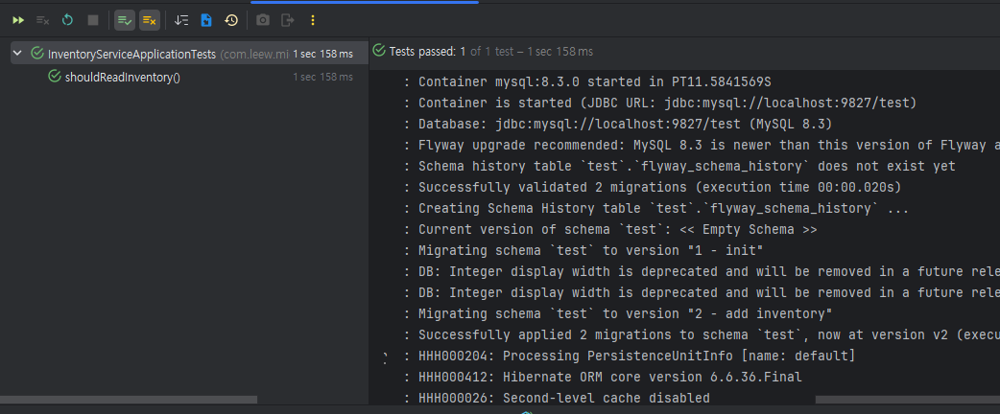

# [Inventory-Service] 인수테스트 수정사항 

### 테스트 오류 발생 

```java
@Import(TestcontainersConfiguration.class)
@SpringBootTest(webEnvironment = SpringBootTest.WebEnvironment.RANDOM_PORT)
class InventoryServiceApplicationTests {

    @ServiceConnection
    static MySQLContainer mySQLContainer = new MySQLContainer("mysql:8.3.0");
    @LocalServerPort
    private Integer port;

    @BeforeEach
    void setup() {
        RestAssured.baseURI = "http://localhost";
        RestAssured.port = port;
    }

    static {
        mySQLContainer.start();
    }

    @Test
    void shouldReadInventory() {
        var response = RestAssured.given()
                .when()
                .get("/api/inventory?skuCode=iphone_15&quantity=1")
                .then()
                .log().all()
                .statusCode(200)
                .extract().response().as(Boolean.class);
        assertTrue(response);

        var negativeResponse = RestAssured.given()
                .when()
                .get("/api/inventory?skuCode=iphone_15&quantity=1000")
                .then()
                .log().all()
                .statusCode(200)
                .extract().response().as(Boolean.class);
        assertFalse(negativeResponse);

    }

}
```

강의 소스대로 그대로 고쳐서 테스트 했더니 
```bash
2025-11-26T09:15:08.660+09:00  INFO 448 --- [inventory-service] [           main] j.LocalContainerEntityManagerFactoryBean : Initialized JPA EntityManagerFactory for persistence unit 'default'

2025-11-26T09:15:08.670+09:00  INFO 448 --- [inventory-service] [           main] tc.mysql:latest                          : Creating container for image: mysql:latest

2025-11-26T09:15:08.765+09:00  INFO 448 --- [inventory-service] [           main] tc.mysql:latest                          : Container mysql:latest is starting: 83526054d6e1a7429c3ad443f86e3a9a27cde6749a0080097a7a04bf8711a27f

2025-11-26T09:15:09.002+09:00  INFO 448 --- [inventory-service] [           main] tc.mysql:latest                          : Waiting for database connection to become available at jdbc:mysql://localhost:9092/test using query 'SELECT 1'

2025-11-26T09:17:09.059+09:00 ERROR 448 --- [inventory-service] [           main] tc.mysql:latest                          : Could not start container
```
위 로그 중 `Container mysql:latest is starting` 메세지와 함께  
테스트를 위한 다른 포트에서 구동한 서버가 DB 포트를 찾지 못해 에러 발생 

### 원인 

import문이 문제 
```java
@Import(TestcontainersConfiguration.class)
```
자동으로 최신 버전의 TestContainers 설정을 테스트에 넣어버리는 것  
-> 기존 환경에 맞지 않게 작동하여 DB 연동 문제가 발생했던 것  


### 해결책 : 

다음 소스코드로 변경하여 해결 
```java
// @Import(TestcontainersConfiguration.class) // 불필요하며 충돌 유발 가능성 있음 (제거)
@SpringBootTest(webEnvironment = SpringBootTest.WebEnvironment.RANDOM_PORT)
class InventoryServiceApplicationTests {

	// 1. @ServiceConnection은 그대로 유지
	// 2. DockerImageName.parse()를 사용해 이미지 이름을 명확히 지정
	// 3. .withEnv("MYSQL_ALLOW_EMPTY_PASSWORD", "true")를 추가하여
	//    MySQL 컨테이너가 "code 1"로 종료되는 문제를 방지 (필수)
//	@ServiceConnection
//	static MySQLContainer mySQLContainer = new MySQLContainer("mysql:8.3.0");
	@ServiceConnection
	static MySQLContainer<?> mySQLContainer = new MySQLContainer<>(DockerImageName.parse("mysql:8.3.0")) // DockerImageName 사용 권장
			.withEnv("MYSQL_ALLOW_EMPTY_PASSWORD", "true"); // 필수: 비밀번호 없이 시작 허용

	@LocalServerPort
	private Integer port;

	@BeforeEach
	void setup() {
		RestAssured.baseURI = "http://localhost";
		RestAssured.port = port;
	}

	// // Spring Boot 3.1+는 @ServiceConnection이 붙은 static 필드를 찾아 자동으로 시작/종료 처리합니다.
//	static {
//		mySQLContainer.start();
//	}

	@Test
	void shouldReadInventory() {
		var response = RestAssured.given()
				.when()
				.get("/api/inventory/exists?skuCode=iphone_15&quantity=1")
				.then()
				.log().all()
				.statusCode(200)
				.extract().response().as(Boolean.class);
		assertTrue(response);

		var negativeResponse = RestAssured.given()
				.when()
				.get("/api/inventory/exists?skuCode=iphone_15&quantity=1000")
				.then()
				.log().all()
				.statusCode(200)
				.extract().response().as(Boolean.class);
		assertFalse(negativeResponse);

	}
}
```

### 문제 해결의 결과 : 정상 작동 및 테스트도 성공 

- mysql 8.3.0에서 정상 수행 + flyway 사항도 적용됨 + 테스트 성공 

---

### 문제 해결 이외의 수정사항 

- DockerImageName.parse() 사용하여 이미지 이름 명확히 지정 
- `withEnv("MYSQL_ALLOW_EMPTY_PASSWORD", "true")` 추가
    - MySQL 컨테이너가 `Exit Code 1`로 종료되는 문제 방지 (필수)
- Spring 3.1버전 이상부터는 static 블록으로 수동 시작하는 로직 제거해도 상관없음

### Exit Code 1로 종료되는 문제 
- MySQL 8.X버전 이상부터는 보안 강화 
- 시작할 때 Root 사용자의 패스워드 설정 / 패스워드 없이 root 접근 허용하는 환경변수 필요 
- Code 1 : 컨테이너 내부의 주 프로세스가 비정상 종료된 상태 
    - 필수 환경변수가 없을 시 보안 검사에 실패하고 즉시 종료됨 -> Exit Code 1 상태

-  해결책 : withEnv 설정으로 루트 패스워드 없이도 시작 허용 

| 유형 | 설명 | 예시 |
|------|-------|-------|
| 필수 환경 변수 누락 | 데이터베이스나 서비스(Redis, Kafka 등)가 작동하는 데 필수적인 설정이 컨테이너 환경 변수로 제공되지 않았을 때. | MySQL에서 `MYSQL_ROOT_PASSWORD`가 없고 `MYSQL_ALLOW_EMPTY_PASSWORD`도 설정되지 않은 경우 |
| 잘못된 설정/인수 | 컨테이너 시작 시 전달된 명령(CMD)이나 설정 파일에 문법적 오류나 잘못된 경로가 있을 때. | 잘못된 포트 매핑, 볼륨 경로 오류, 설정 파일의 오타 |
| 권한 문제 | 컨테이너 내부에서 파일 시스템 접근, 포트 바인딩 등에 대한 OS 권한이 부족할 때. | 컨테이너가 특정 볼륨에 쓰기 권한이 없을 때 |
| 의존성 실패 | 컨테이너가 시작 시 내부 의존성(라이브러리, 설정 파일 등)을 찾지 못하거나 로드하지 못했을 때. | Java 애플리케이션에서 `java.io.FileNotFoundException` 발생 후 JVM 종료 |


### Exit Code 1 비정상 종료가 문제가 되는 이유 

1. 테스트 실패 
    - TestContainers: 컨테이너 시작 후 해당 서비스가 완전히 준비될 때까지 대기
    - DB의 경우 JDBC 연결을 시도하는 것이 일반적 
    - code 1으로 종료되면 이 전략이 실패 -> 테스트 불가 

2. 데이터 소스 연결 실패 
    - ServiceConnection : 컨테이너가 정상 작동 중이라는 전제 하에 연결 정보 가져옴 
    - 컨테이너가 시작되지 않으면 연결 정보 주입 자체가 불가 
    - 애플리케이션 컨텍스트를 로드할 때 데이터 소스 연결에 실패하여 SpringBoot 서버가 시작되지 못한다. 
    - `만약 CI/CD 파이프라인을 만들었다면, 테스트 실패로 인해 자동화된 프로세스 중단`

3. 디버깅의 어려움 
    - Code 1 오류만으로 무엇이 오류인 지 알 수 없다. 
    - 사용자는 실제 컨테이너의 내부 로그 확인 필요 
    - TestContainers가 시작 단계에서 실패하면 로그 기록도 불완전할 수 있다. 