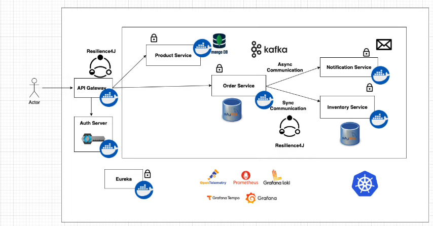
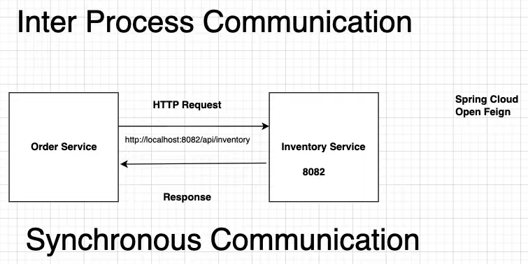
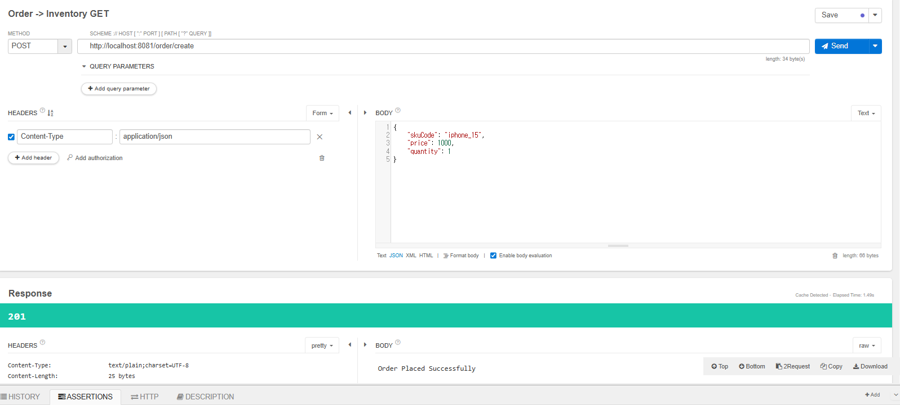
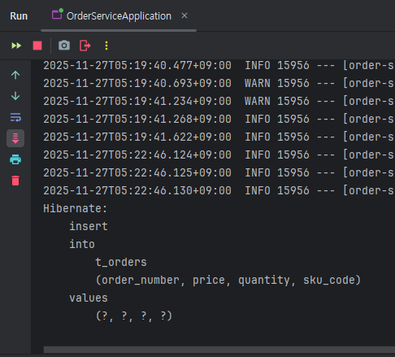
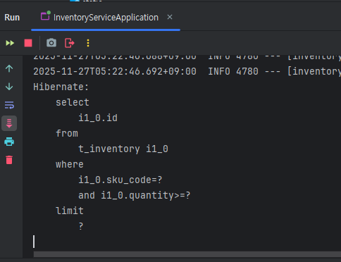

# 서버 간 통신 


위 서버 구조 중  
Order service - [Notification Service / Inventory Service]가 서로 연동된 상태  
이 구조를 모두 연동시켜야 한다. 

이 서버 간 연동 과정을  
`Spring Cloud Feign`을 사용하여 연동할 예정

### 프로젝트 내 통신 시나리오 
1. 클라이언트의 Order 과정을 수행하기 위해 
2. Inventory 서버에서 재고(stock)이 있는 지 확인해야 한다. 
3. 각 기능은 다른 서버에 구현되어 있기 때문에 각 서버 간 통신이 필요하다. 

---

### 구현할 기능 : Order Service 서버에서 Inventory Service 서버에 통신 


- 사용할 라이브러리 : `Spring Cloud OpenFeign`

---

### 설정 이전에 변경사항 
- MySQL을 사용하는 Order-Service / Inventory Service 모두 Docker-compose 실행해야 해서 
    - docker-compose.yml 설정값 변경 
    - 컨테이너 이름 변경 및 각 컨테이너의 포트 변경 
        - order-service: 3307:3306
        - inventory-service: 3308:3306
- `order-service/docker-compose.yaml`: 
```yaml
version: '4'

services:
  mysql:
    image: mysql:8.3.0
    container_name: order-service-mysql
    environment:
      MYSQL_ROOT_PASSWORD: mysql
    ports:
      - "3307:3306"
    volumes:
      - ./mysql:/var/lib/mysql
      - ./docker/mysql/init.sql:/docker-entrypoint-initdb.d/init.sql
```

- `inventory-service/docker-compose.yaml`:
```yaml
version: '4'

services:
  mysql:
    image: mysql:8.3.0
    container_name: inventory-service-mysql
    environment:
      MYSQL_ROOT_PASSWORD: mysql
    ports:
      - "3308:3306"
    volumes:
      - ./mysql/init.sql:/docker-entrypoint-initdb.d/init.sql
      - ./docker/mysql/data:/var/lib/mysql
```

## Order-Service -> Inventory Service 통신 위한 설정
- 아래의 모든 설정은 Order Service에서 Inventory Service에게 통신 보내기 위한 설정
- 따라서 `Order Service 서버에만 설정`하면 됨 

### 1. build.gradle 설정 
- ext의 SpringCloudVersion은 내가 Spring Initializr에서 설정한 프로젝트 버전에 따라 
- 직접 공식 문서 검색해서 확인해야 함 
    - [공식 문서](https://spring.io/projects/spring-cloud#overview)
  
  
```groovy
ext {
	// ← Spring Boot 3.4.x와 호환되는 Spring Cloud 버전
	springCloudVersion = "2024.0.1"
}

dependencies {
	/* ------------------------------
	 * Spring Cloud Core + Feign
	 * ------------------------------ */
	implementation 'org.springframework.cloud:spring-cloud-starter-bootstrap'
	implementation 'org.springframework.cloud:spring-cloud-starter-openfeign'
	implementation 'org.springframework.cloud:spring-cloud-starter-loadbalancer'

	/* ------------------------------
     * Spring Cloud Netflix (필요 시)
     * ------------------------------ */
	// implementation 'org.springframework.cloud:spring-cloud-starter-netflix-eureka-server'
	// implementation 'org.springframework.cloud:spring-cloud-starter-netflix-eureka-client'

    ,,,
}


dependencyManagement {
	imports {
		mavenBom "org.springframework.cloud:spring-cloud-dependencies:${springCloudVersion}"
	}
}
```

- `지금 당장 Eureka 설정하지 않는 이유` : 
    - Eureka는 Service Discovery 위한 별도의 서버 구축 시 필요 
    - 지금 당장은 Order 서버에서 Inventory 서버로 접속하기 위한 기능만 
        - 지금은 OpenFeign 및 Spring Cloud 설정만 수행 


### 2. OpenFeign 설정 

####  `client/InventoryClient.java` : 
```java
package com.leew.microservice.order_service.client;

import org.springframework.cloud.openfeign.FeignClient;
import org.springframework.web.bind.annotation.RequestMapping;
import org.springframework.web.bind.annotation.RequestMethod;
import org.springframework.web.bind.annotation.RequestParam;

/**
 * value: Inventory-service의 application.yml에서 설정한 이름
 * spring:
 *   application:
 *     name: inventory-service // 이거
 *
 *  나중에 eureka 서버 사용하게 되면, 정적 url 없이 사용하게 될 것
 *  url 키워드는 삭제할 예정
 */
@FeignClient(value = "inventory-service", url = "http://localhost:8082")
public interface InventoryClient {
    @RequestMapping(method = RequestMethod.GET, value = "/api/inventory/exists")
    boolean isInStock(@RequestParam(value = "skuCode") String skuCode, @RequestParam(value = "quantity") Integer quantity);
}
```
 * value: Inventory-service의 application.yml 파일에서 설정한 이름
 ```groovy
  spring:
    application:
      name: inventory-service // 이거
 ```
 *  나중에 eureka 서버 사용하게 되면, 정적 url 없이 사용하게 될 것
 *  url 키워드는 삭제할 예정

- InventoryClient에서 사용할 Controller 매핑 
    - 인터페이스이고, 통신 입구만 구현되므로 함수 정의까지는 할 필요 없음 
```java
@RequestMapping(method = RequestMethod.GET, value = "/api/inventory/exists")
    boolean isInStock(@RequestParam(value = "skuCode") String skuCode, @RequestParam(value = "quantity") Integer quantity);
```

- `정적 URL 바인딩` : 
    - 위 코드에서 `FeignClient 내 url 변수 매핑 부분`에 해당 
    - 로컬 환경에서 테스트할 때는 유리하지만, MSA 환경의 이점을 살리지는 못한다. 
    - Spring Cloud 환경에서는 서비스 디스커버리 활용하는 것이 일반적 
- 위 방식은 추후 Eureka 서버 사용 시 변경할 예정 

#### Application 설정 
```java
@SpringBootApplication
@EnableFeignClients
public class OrderServiceApplication {

	public static void main(String[] args) {
		SpringApplication.run(OrderServiceApplication.class, args);
	}

}
```
- `@EnableFeignClients` 매핑하여 해당 Application이 FeignClient 역할임을 설정

#### `OrderService.java` : 
```java
@Service
@RequiredArgsConstructor
public class OrderService {

    private final OrderRepository orderRepository;
    private final InventoryClient inventoryClient;

    public void placeOrder(OrderRequest orderRequest) {
        /**
         * 아래 내용 추가 -> 
         *      inventoryClient에서 통신할 함수 선언하면 
         *      해당 함수 사용하여 통신하여 변수 가져오기  
         */
        var isProductInStock = inventoryClient.isInStock(orderRequest.skuCode(), orderRequest.quantity());

        if (isProductInStock) {
            var order = mapToOrder(orderRequest);
            orderRepository.save(order);
            return;
        }
        throw new RuntimeException("Product with Skucode: " + orderRequest.skuCode() + " is not in stock");
    }

    private static Order mapToOrder(OrderRequest orderRequest) {
        ,,,
    }
}
```

## 테스트 실행 결과 : 정상 작동 

1. 최종 결과 :
- [POST] `http://localhost:8081/order/create`
```json
{
 	"skuCode": "iphone_15", 
  	"price": 1000, 
  	"quantity": 1
}
```

- Order -> Inventory GET 매핑 성공 

2. Order-Service 서버에서의 트랜잭션 로그 

- 새로 추가하는 내용만 있으므로 Insert문만 존재 


- DB 확인: (성공) 실제로 [price: 1000 + quantity: 1]인 데이터 저장됨 

3. Inventory-Service 서버에서의 트랜잭션 로그 

- DB에 데이터 있는 지 판단하는 Select Query문만 존재