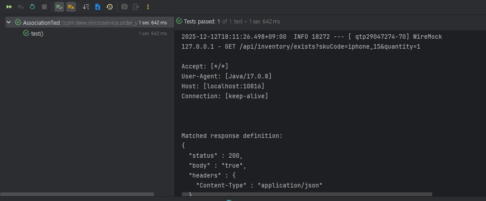
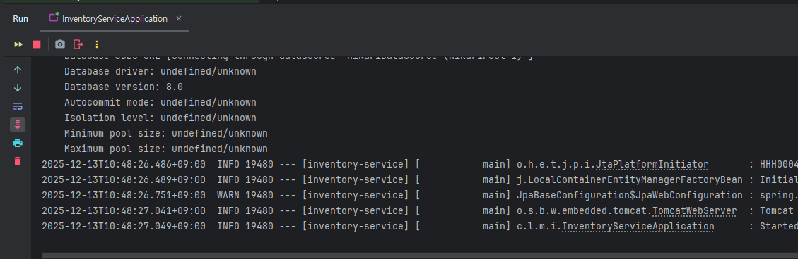
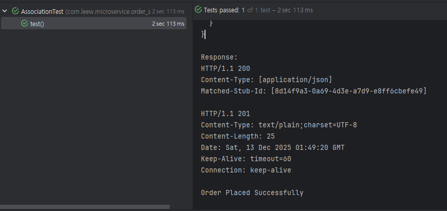

# 07 Sync Communication 코드 테스트 작성 

## 목표 : 

- 기존 작성한 OrderService 테스트 
    - MySQL TestContainers 사용하여 Order 내 DB 호출만 테스트 

- 새로 작성한 OrderService 코드는 
    - Inventory까지 추가하기 때문에 
        - 실제 FeignClient -> Inventory API 호출을 사용해 Order 테스트 필요

- 하지만 Inventory API는 StubRunner / MockServer 없기 때문에 
    - FeignClient 호출 실패 

-> 그래서  
`StubRunner 기반 Inventory 응답(true) 만들어 주는 테스트 필요`

## 해결 방법 2가지 
1. 기존 테스트에 StubRunner 추가하여 통합 테스트로 확장 
2. StubRunner 테스트를 별도 테스트 클래스로 분리 

## 코드 작성 

### 1. [order-service] InventoryClient 코드 수정 
- InventoryClient.java : 
    - url 부분 변수 수정 : application.yml에서 매핑받을 예정 
```java
@FeignClient(value = "inventory-service", url = "${inventory.url}")
public interface InventoryClient {
    @RequestMapping(method = RequestMethod.GET, value = "/api/inventory/exists")
    boolean isInStock(@RequestParam(value = "skuCode") String skuCode, @RequestParam(value = "quantity") Integer quantity);
}
```

- application.yml 수정사항 : (main/resources)
```yaml
server:
  port: 8081

spring:
  application:
    name: order-service

    ,,,

### 추가할 부분, server / spring과 같이 top indent에 맞춘다.
inventory:
  url: http://localhost:8082
```


### 2. [order-service] `test/resources/application.yml` 생성 
```yaml
inventory:
  url: http://localhost:${wiremock.server.port}
```

### 3. test 디렉토리에 `stubs/InventoryClientStubs` 생성 
- 위치 : `com.leew.microservice.order_service.stubs`
```java
package com.leew.microservice.order_service.stubs;

import lombok.experimental.UtilityClass;
import static com.github.tomakehurst.wiremock.client.WireMock.*;

@UtilityClass
public class InventoryClientStub {

    /**
     * 재고 충분 -> true 반환
     */
    public static void stubInventoryCall(String skuCode, Integer quantity) {
        stubFor(get(urlEqualTo("/api/inventory/exists?skuCode=" + skuCode + "&quantity=" + quantity))
                .willReturn(aResponse()
                        .withStatus(200)
                        .withHeader("Content-Type", "application/json")
                        .withBody("true")
        ));
    }

    /**
     *  재고 부족 -> false 반환
     */
    public void stubInventoryOutOfStock(String skuCode, Integer quantity) {

        // 재고 부족 → false 반환
        stubFor(get(urlEqualTo("/api/inventory/exists?skuCode=" + skuCode + "&quantity=" + quantity))
                .willReturn(aResponse()
                        .withStatus(200)
                        .withHeader("Content-Type", "application/json")
                        .withBody("false")));
    }
}
```

### 4. Test 클래스 생성 : `AssociationTest.java` : 
```java
package com.leew.microservice.order_service;

import com.leew.microservice.order_service.stubs.InventoryClientStub;
import io.restassured.RestAssured;
import org.hamcrest.Matchers;
import org.junit.jupiter.api.BeforeEach;
import org.junit.jupiter.api.Test;
import org.springframework.boot.test.context.SpringBootTest;
import org.springframework.boot.test.web.server.LocalServerPort;
import org.springframework.boot.testcontainers.service.connection.ServiceConnection;
import org.springframework.cloud.contract.wiremock.AutoConfigureWireMock;
import org.testcontainers.containers.MySQLContainer;

import static org.hamcrest.MatcherAssert.assertThat;

@SpringBootTest(webEnvironment = SpringBootTest.WebEnvironment.RANDOM_PORT)
@AutoConfigureWireMock(port = 0)
public class AssociationTest {

    @ServiceConnection
    static MySQLContainer mySQLContainer = new MySQLContainer("mysql:8.3.0");
    @LocalServerPort
    private Integer port;

    @BeforeEach
    void setup() {
        RestAssured.baseURI = "http://localhost";
        RestAssured.port = port;
    }

//    static {
//        mySQLContainer.start();
//    }

    @Test
    void test() {
        String submitOrderJson = """
                {
                     "skuCode": "iphone_15",
                     "price": 1000,
                     "quantity": 1
                }
                """;

        InventoryClientStub.stubInventoryCall("iphone_15", 1);


        var responseBodyString = RestAssured.given()
                .contentType("application/json")
                .body(submitOrderJson)
                .when()
                .post("/order/create")
                .then()
                .log().all()
                .statusCode(201)
                .extract()
                .body().asString();

        assertThat(responseBodyString, Matchers.is("Order Placed Successfully"));
    }
}
```

## 실행 결과 : 테스트 성공으로 뜬다.

- GET 요청을 WireMock 사용하여 inventory 서버에 보내는 것을 확인할 수 있다. 
    - 하지만 이것은 실제로 보내는 것이 아니다. 

## Stub의 결과물을 RestAssured에서 사용하지 않는데 어떻게 Stub에서 assertThat을 설정하는 것인지 

RestAssured는 Stub을 “사용”하는 게 아니라,  
OrderService가 내부적으로 FeignClient를 통해 Inventory API를 호출할 때  
그 HTTP 요청이 WireMock Stub으로 자동으로 “가로채진다”.  
  
따라서 RestAssured는 Stub을 모르는 상태이지만,  
OrderService 내부 로직이 Stub의 true/false 결과를 영향을 받아 동작한 것이다.  

- 실제로 inventory-service Application에 가면, controller 요청이 오지 않았음 
    - 테스트를 위해 운영 중인 서버에 요청을 부여하지 않음  


- RestAssured가 요청 → Controller → Service 로직 실행: 
    `boolean inStock = inventoryClient.isInStock(orderRequest.skuCode(), orderRequest.quantity());`
- 여기서 FeignClient가 Inventory 서비스로 HTTP GET 요청을 실제로 보냄:
    `GET /api/inventory?skuCode=iphone_15&quantity=1`
- 그런데 Inventory 실제 서버는 없고 WireMock이 대신 응답한다. 
    - 테스트 클래스에 다음이 있기 때문:
    - `@AutoConfigureWireMock(port = 0)`
- WireMock이 랜덤 포트로 가짜 서버를 띄운 후
    - application-test.yml 에 주입된다:
```yaml
inventory:
  url: "http://localhost:${wiremock.server.port}"
```
- WireMock Stub 이 그 요청과 URL을 매칭하여 응답한다. 
```java
InventoryClientStub.stubInventoryCall("iphone_15", 1);
```
- 해당 Stub은 다음 HTTP 요청이 들어오면 : 
```bash
/api/inventory?skuCode=iphone_15&quantity=1
```
-> 200 OK + body: true 를 반환하도록 WireMock 서버에 규칙을 등록하는 것
- FeignClient는 WireMock 의 true 응답을 받아간다

## 왜 response Code가 2개 ?? 

- Status Code 200은 WireMock Stub 응답 
- Status Code 201은 실제 OrderService API 응답 
  
서로 다른 두 서버의 응답이 한 로그에 함께 출력된 것   
- 에러도 아니고 정상 동작이다. 

1. FeignClient → WireMock 호출의 응답 (200 OK)
- OrderService 내부에서 FeignClient가 Inventory API를 호출한다:  
    inventoryClient.isInStock(...)  
    - 이때 FeignClient는 실제 Inventory 서버가 아니라 WireMock Stub 서버로 HTTP 요청을 보낸다:
2. RestAssured → OrderService API 호출의 응답 (201 Created)
- OrderService는 WireMock 응답(true)을 받고 주문 저장을 성공시키면
201 Created를 반환한다:
  
| 응답               | 누가 반환?        | 의미                        |
| ---------------- | ------------- | ------------------------- |
| **HTTP/1.1 200** | WireMock Stub | Inventory 재고 확인 API 가짜 응답 |
| **HTTP/1.1 201** | OrderService  | 주문 생성 성공 응답               |

  
> RestAssured .log().all() 때문에 이렇게 보이는 것  
log().all() 은 HTTP 요청 과정에서 발생한 모든 네트워크 로그를 출력한다.


## TODO: 
- Kafka 포함한 E2E 테스트 (TestContainers 기반)